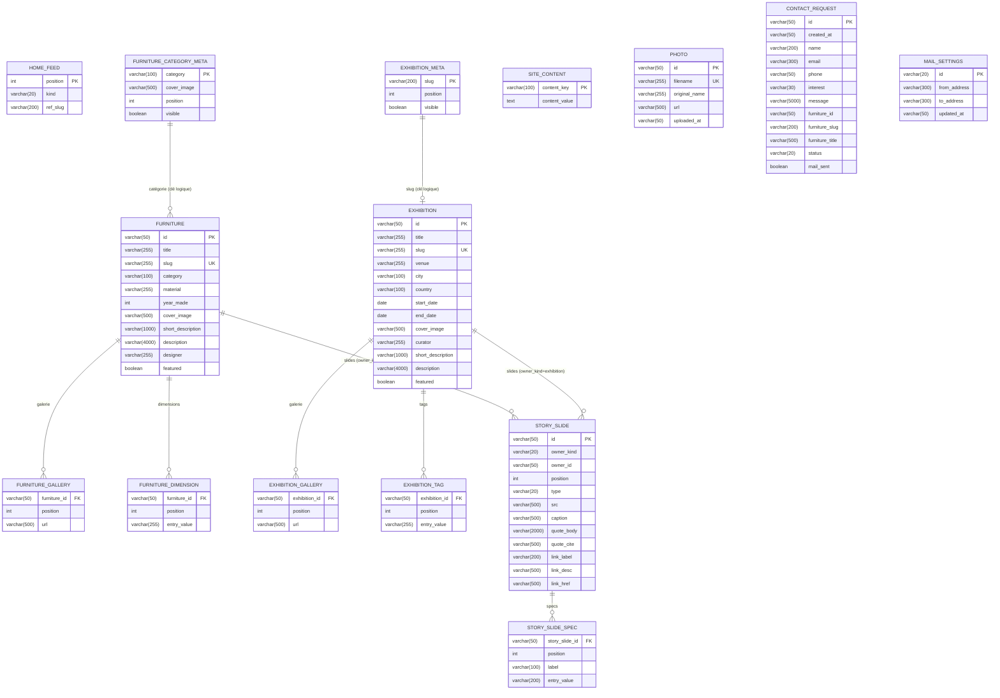

# Modèle de données

> Version : mai 2026 — reflète l'état du changelog Liquibase jusqu'à la migration `017`.

---

## Diagramme entité-relation



---

## Tables

### `furniture` — Catalogue des meubles

Table centrale du catalogue. Chaque meuble possède un `slug` unique utilisé dans les URLs publiques.

| Colonne            | Type          | Contraintes          | Description                                |
|--------------------|---------------|----------------------|--------------------------------------------|
| `id`               | varchar(50)   | PK, NOT NULL         | Identifiant métier (ex. `"chaise-01"`)     |
| `title`            | varchar(255)  | NOT NULL             | Titre affiché                              |
| `slug`             | varchar(255)  | NOT NULL, UNIQUE     | Segment d'URL                              |
| `category`         | varchar(100)  | NOT NULL             | Catégorie (correspond à `furniture_category_meta.category`) |
| `material`         | varchar(255)  |                      | Matière principale                         |
| `year_made`        | int           |                      | Année de création                          |
| `cover_image`      | varchar(500)  |                      | URL de l'image de couverture               |
| `short_description`| varchar(1000) |                      | Résumé court (liste, vignette)             |
| `description`      | varchar(4000) |                      | Description longue (page détail)           |
| `designer`         | varchar(255)  |                      | Nom du designer                            |
| `featured`         | boolean       | NOT NULL, DEFAULT false | Mis en avant sur la page d'accueil      |

---

### `furniture_gallery` — Galerie d'images des meubles

Collection ordonnée d'URLs d'images associées à un meuble (ElementCollection JPA).

| Colonne       | Type         | Contraintes                            | Description             |
|---------------|--------------|----------------------------------------|-------------------------|
| `furniture_id`| varchar(50)  | PK, FK → `furniture(id)` CASCADE DELETE | Meuble parent          |
| `position`    | int          | PK                                     | Ordre d'affichage       |
| `url`         | varchar(500) | NOT NULL                               | URL de l'image          |

---

### `furniture_dimension` — Dimensions des meubles

Liste ordonnée de chaînes de dimensions (ex. `"L 80 × P 40 × H 75 cm"`).

| Colonne       | Type         | Contraintes                            | Description              |
|---------------|--------------|----------------------------------------|--------------------------|
| `furniture_id`| varchar(50)  | PK, FK → `furniture(id)` CASCADE DELETE | Meuble parent           |
| `position`    | int          | PK                                     | Ordre dans la liste      |
| `entry_value` | varchar(255) | NOT NULL                               | Valeur de la dimension   |

---

### `exhibition` — Catalogue des expositions

Symétrique à `furniture`. Chaque exposition a un `slug` unique utilisé en URL.

| Colonne            | Type          | Contraintes          | Description                                |
|--------------------|---------------|----------------------|--------------------------------------------|
| `id`               | varchar(50)   | PK, NOT NULL         | Identifiant métier                         |
| `title`            | varchar(255)  | NOT NULL             | Titre de l'exposition                      |
| `slug`             | varchar(255)  | NOT NULL, UNIQUE     | Segment d'URL                              |
| `venue`            | varchar(255)  |                      | Lieu (galerie, musée…)                     |
| `city`             | varchar(100)  |                      | Ville                                      |
| `country`          | varchar(100)  |                      | Pays                                       |
| `start_date`       | date          |                      | Date de début                              |
| `end_date`         | date          |                      | Date de fin                                |
| `cover_image`      | varchar(500)  |                      | URL de l'image de couverture               |
| `curator`          | varchar(255)  |                      | Commissaire d'exposition                   |
| `short_description`| varchar(1000) |                      | Résumé court                               |
| `description`      | varchar(4000) |                      | Description longue                         |
| `featured`         | boolean       | NOT NULL, DEFAULT false | Mis en avant sur la page d'accueil      |

---

### `exhibition_gallery` — Galerie d'images des expositions

Collection ordonnée d'URLs d'images (même patron que `furniture_gallery`).

| Colonne         | Type         | Contraintes                              | Description         |
|-----------------|--------------|------------------------------------------|---------------------|
| `exhibition_id` | varchar(50)  | PK, FK → `exhibition(id)` CASCADE DELETE | Exposition parente  |
| `position`      | int          | PK                                       | Ordre d'affichage   |
| `url`           | varchar(500) | NOT NULL                                 | URL de l'image      |

---

### `exhibition_tag` — Tags des expositions

Liste ordonnée de mots-clés associés à une exposition.

| Colonne         | Type         | Contraintes                              | Description         |
|-----------------|--------------|------------------------------------------|---------------------|
| `exhibition_id` | varchar(50)  | PK, FK → `exhibition(id)` CASCADE DELETE | Exposition parente  |
| `position`      | int          | PK                                       | Ordre dans la liste |
| `entry_value`   | varchar(255) | NOT NULL                                 | Valeur du tag       |

---

### `story_slide` — Diaporama narratif

Slides éditoriaux attachés à un meuble **ou** une exposition via une relation polymorphique (`owner_kind` + `owner_id`). Pas de clé étrangère déclarée — la cohérence est maintenue applicativement.

| Colonne       | Type          | Contraintes | Description                                                            |
|---------------|---------------|-------------|------------------------------------------------------------------------|
| `id`          | varchar(50)   | PK          | Identifiant du slide                                                   |
| `owner_kind`  | varchar(20)   | NOT NULL    | `"furniture"` ou `"exhibition"`                                        |
| `owner_id`    | varchar(50)   | NOT NULL    | `id` du meuble ou de l'exposition                                      |
| `position`    | int           | NOT NULL    | Ordre du slide dans le diaporama                                       |
| `type`        | varchar(20)   | NOT NULL    | `cover` · `image` · `spec` · `quote` · `link`                         |
| `src`         | varchar(500)  |             | URL de l'image (types `cover`, `image`)                                |
| `caption`     | varchar(500)  |             | Légende de l'image                                                     |
| `quote_body`  | varchar(2000) |             | Corps de la citation (type `quote`)                                    |
| `quote_cite`  | varchar(500)  |             | Auteur / source de la citation                                         |
| `link_label`  | varchar(200)  |             | Libellé du lien (type `link`)                                          |
| `link_desc`   | varchar(500)  |             | Description du lien                                                    |
| `link_href`   | varchar(500)  |             | URL du lien                                                            |

**Index** : `idx_story_slide_owner_pos` sur (`owner_kind`, `owner_id`, `position`).

---

### `story_slide_spec` — Spécifications d'un slide

Paires label/valeur affichées dans un slide de type `spec` (ElementCollection JPA).

| Colonne          | Type         | Contraintes                               | Description        |
|------------------|--------------|-------------------------------------------|--------------------|
| `story_slide_id` | varchar(50)  | PK, FK → `story_slide(id)` CASCADE DELETE | Slide parent       |
| `position`       | int          | PK                                        | Ordre de la spec   |
| `label`          | varchar(100) | NOT NULL                                  | Libellé            |
| `entry_value`    | varchar(200) | NOT NULL                                  | Valeur             |

---

### `home_feed` — Fil de la page d'accueil

Ordonnancement éditorial des meubles et expositions affichés sur la page d'accueil. Référence les entités via `kind` + `ref_slug` (lien logique, pas de FK).

| Colonne    | Type         | Contraintes | Description                                       |
|------------|--------------|-------------|---------------------------------------------------|
| `position` | int          | PK          | Position dans le fil (ordre croissant)            |
| `kind`     | varchar(20)  | NOT NULL    | `"furniture"` ou `"exhibition"`                   |
| `ref_slug` | varchar(200) | NOT NULL    | `slug` du meuble ou de l'exposition               |

---

### `furniture_category_meta` — Métadonnées des catégories de meubles

Paramètres d'affichage par catégorie. La clé `category` correspond à la valeur de `furniture.category`.

| Colonne       | Type         | Contraintes              | Description                            |
|---------------|--------------|--------------------------|----------------------------------------|
| `category`    | varchar(100) | PK                       | Nom de la catégorie (clé logique)      |
| `cover_image` | varchar(500) | NOT NULL                 | Image de couverture de la catégorie    |
| `position`    | int          | NOT NULL                 | Ordre d'affichage dans la navigation   |
| `visible`     | boolean      | NOT NULL, DEFAULT true   | La catégorie est-elle visible publiquement |

---

### `exhibition_meta` — Métadonnées des expositions (affichage)

Paramètres de visibilité et d'ordre pour les expositions dans les vues liste. La clé `slug` correspond à `exhibition.slug`.

| Colonne    | Type         | Contraintes            | Description                                    |
|------------|--------------|------------------------|------------------------------------------------|
| `slug`     | varchar(200) | PK                     | Slug de l'exposition (clé logique)             |
| `position` | int          | NOT NULL               | Ordre dans la liste des expositions            |
| `visible`  | boolean      | NOT NULL, DEFAULT true | L'exposition est-elle visible publiquement     |

---

### `site_content` — Contenu CMS libre

Stockage clé-valeur pour les blocs de texte éditoriaux du site (bio, mentions légales, textes de pages…).

| Colonne         | Type         | Contraintes | Description                        |
|-----------------|--------------|-------------|------------------------------------|
| `content_key`   | varchar(100) | PK          | Identifiant sémantique du contenu  |
| `content_value` | text (CLOB)  |             | Contenu brut (Markdown ou texte)   |

---

### `photo` — Médiathèque

Métadonnées des fichiers images téléversés. Le fichier physique est stocké sur disque sous `app.upload.dir` ; `url` pointe vers le endpoint `/api/photos/{filename}`.

| Colonne         | Type         | Contraintes | Description                             |
|-----------------|--------------|-------------|-----------------------------------------|
| `id`            | varchar(50)  | PK          | Identifiant interne                     |
| `filename`      | varchar(255) | NOT NULL, UNIQUE | Nom de fichier sur disque          |
| `original_name` | varchar(255) | NOT NULL    | Nom original au moment du téléversement |
| `url`           | varchar(500) | NOT NULL    | URL publique de la photo                |
| `uploaded_at`   | varchar(50)  | NOT NULL    | Horodatage ISO 8601                     |

---

### `contact_request` — Demandes de contact

Formulaire de contact côté public. Les champs `furniture_*` sont **dénormalisés** : ils capturent l'état du meuble au moment de la soumission, sans FK vivante.

| Colonne           | Type          | Contraintes            | Description                                     |
|-------------------|---------------|------------------------|-------------------------------------------------|
| `id`              | varchar(50)   | PK                     | Identifiant de la demande                       |
| `created_at`      | varchar(50)   | NOT NULL               | Horodatage ISO 8601                             |
| `name`            | varchar(200)  | NOT NULL               | Nom du demandeur                                |
| `email`           | varchar(300)  | NOT NULL               | Adresse e-mail                                  |
| `phone`           | varchar(50)   |                        | Téléphone (optionnel)                           |
| `interest`        | varchar(30)   | NOT NULL               | Type d'intérêt (`commande`, `information`…)     |
| `message`         | varchar(5000) | NOT NULL               | Corps du message                                |
| `furniture_id`    | varchar(50)   |                        | ID du meuble concerné (snapshot)                |
| `furniture_slug`  | varchar(200)  |                        | Slug du meuble (snapshot)                       |
| `furniture_title` | varchar(500)  |                        | Titre du meuble (snapshot)                      |
| `status`          | varchar(20)   | NOT NULL, DEFAULT 'NEW'| `NEW` · `READ` · `ARCHIVED`                    |
| `mail_sent`       | boolean       | NOT NULL, DEFAULT false| Accusé de réception envoyé par e-mail           |

**Index** : sur `created_at` (tri chronologique en vue admin).

---

### `mail_settings` — Configuration e-mail

Paramètres de l'expéditeur et du destinataire des e-mails transactionnels. Une seule ligne (`id = "default"`). L'envoi est délégué à l'API Resend (ADR-0014) ; les colonnes SMTP historiques ont été supprimées en migration `017`.

| Colonne        | Type         | Contraintes | Description                           |
|----------------|--------------|-------------|---------------------------------------|
| `id`           | varchar(20)  | PK          | Toujours `"default"`                  |
| `from_address` | varchar(300) |             | Adresse expéditrice (Resend)          |
| `to_address`   | varchar(300) |             | Adresse destinataire des notifications|
| `updated_at`   | varchar(50)  | NOT NULL    | Horodatage de la dernière mise à jour |

---

## Conventions et patterns

### Identifiants métier (varchar PK)

Les PKs de `furniture`, `exhibition`, `story_slide`, `photo` et `contact_request` sont des `varchar(50)` assignés applicativement (UUID ou slug court), pas des séquences auto-incrémentées. Cela simplifie les imports Liquibase et rend les IDs lisibles dans les logs.

### ElementCollections (tables de collection)

`furniture_gallery`, `furniture_dimension`, `exhibition_gallery`, `exhibition_tag` et `story_slide_spec` sont des **ElementCollections JPA** : elles n'ont pas d'identité propre et sont toujours lues/écrites en bloc via l'entité parente. La PK composite `(parent_id, position)` garantit l'ordre et l'unicité.

### Relation polymorphique (`owner_kind` + `owner_id`)

`story_slide` peut appartenir à un meuble **ou** à une exposition. Plutôt qu'une table d'union ou une hiérarchie d'héritage, le discriminant `owner_kind` + la clé `owner_id` assurent ce polymorphisme. Il n'y a pas de FK déclarée — la cohérence est maintenue par la couche service (suppression en cascade gérée applicativement).

### Liens logiques (pas de FK)

`home_feed.ref_slug`, `furniture_category_meta.category` et `exhibition_meta.slug` sont des **clés logiques** qui pointent vers `furniture.slug`, `furniture.category` et `exhibition.slug` respectivement. Ce choix évite des contraintes FK sur des chaînes métier et facilite les imports/exports sans ordre de dépendance strict.

### Dénormalisation dans `contact_request`

Les champs `furniture_*` sont un **snapshot** : ils immortalisent le titre et le slug du meuble au moment de la demande. Si le meuble est renommé ou supprimé ultérieurement, la demande reste lisible sans JOIN.

### Horodatages en `varchar(50)`

Plusieurs tables stockent les timestamps sous forme de chaîne ISO 8601 (`varchar(50)`) plutôt qu'un type `timestamp`. Ce choix facilite la portabilité H2/PostgreSQL et la sérialisation JSON directe, au prix de l'absence de requêtes de plage natives.

---

## Gestion des migrations

Le schéma est piloté exclusivement par **Liquibase** ; Hibernate tourne en mode `validate` (il ne crée jamais de table). Toutes les migrations se trouvent dans :

```
backend/src/main/resources/db/changelog/changes/
```

enregistrées dans `db.changelog-master.yaml`. Les tests d'intégration rejouent le changelog complet contre H2 en mode PostgreSQL — une migration cassée casse la suite de tests. Ajouter une table ou une colonne = créer un nouveau fichier numéroté, jamais modifier un fichier existant.
